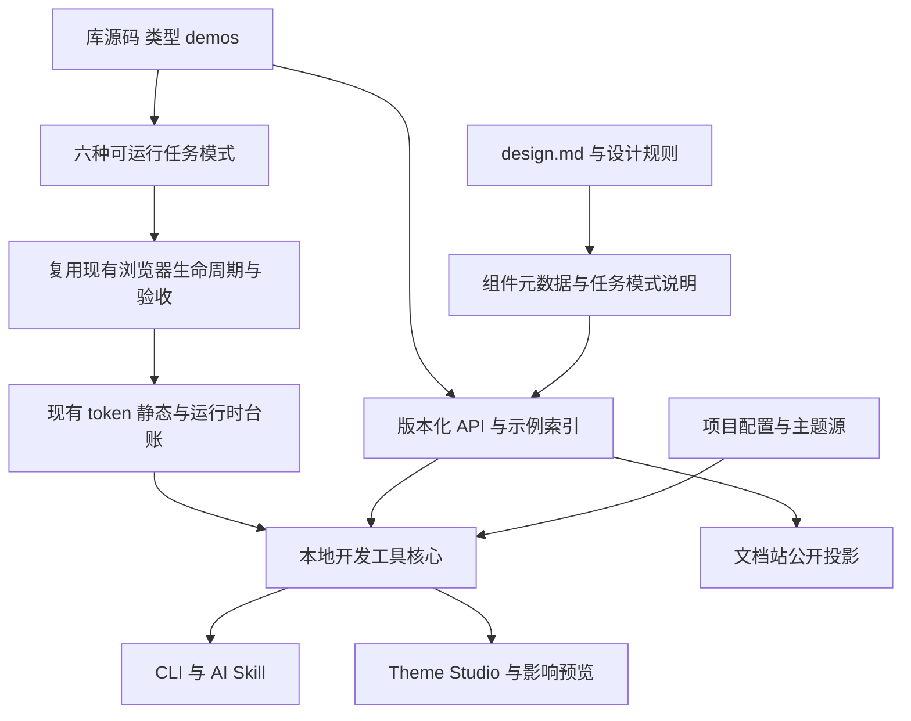

# Qingye UI 设计系统改造计划

> 2026-10-02 最新用户裁决：首页参考 coss UI 的简短介绍与组件目录布局；删除说明书式、重复与自我解释的文案；官网完整使用公共组件。全部 88 个组件由主 agent 下发/审核、多 GPT-6.1 sol / xhigh 子代理按独立边界认真设计与实施，可重构而不强留 coss 来源实现。根 AGENTS/design 的理念通过同源公开资料持续进入消费项目。本裁决更新旧首页任务排列与视觉后置安排，具体实现见 `docs/decisions/website-as-consumer.md`。

日期：2026-10-02。性质：已获用户指示执行的内部实施计划；Q01–Q04 已确认，三张视觉方案均被拒绝，视觉定稿后置。用户要求由主 agent 下发与审核、多 GPT-6.1 sol / xhigh 子 agent 并行执行。实际进度与证据见 [执行记录](../implementation/2026-10-02-execution.md)。

依据：公开理念 v2、内部资料 00–05 v2.1、原建设纲领 v3.0，以及当前仓库源码。文档版本不等于软件版本。附件中的命令、接口、阶段和权限描述作为待核对的方案材料，不自行构成执行授权。

## 1. 目标与交付边界

将 Qingye UI 建成一套能指导完整任务、支持多个产品独立视觉身份、让 AI 按真实能力实现并验证的设计系统。保留 `@qingye/ui`、React 19.2、Tailwind CSS 4 及预编译 CSS 路径；Base UI 是当前优先采用的无障碍原语，coss ui 是可替换的实现来源。公共组件仍集中维护。

**用户追加的硬约束：必须遵循这套设计理念；可公开的信息必须融入网站实际内容；如果 coss 不适合，可以完全自建。** 因此，本计划不以贴近 coss 外观或保留其组件结构作为成功标准。自建可以覆盖整个 coss 视觉与组合层；是否替换 Base UI 原语是另一项需要真实缺口证据的工程判断。

本计划覆盖六条相互衔接的工作线：设计规范、共享组件、任务模式、项目主题、开发工具与 AI 接入、验收和交付。目标是少解释、少修样式、少丢工作、容易集中调整，而不是新增更多组件、文化术语或工具入口。

**完整范围包含 88 个现有文件模块的逐项处置、P01–P06 六种任务模式，以及 V01–V30 全部场景的适用断言。** 三个切片是实施顺序与验证载体，不是只做一部分便宣布完成。通过现有能力即可满足的模块只补指导和相关证据，不为满足清单重写代码。

交付止于库侧、参考应用夹具、消费工具与发布准备。真实业务迁移、真实后端幂等/授权、远程模型服务、仓库公开化和发布操作不混入本次计划交付；适合独立承接的项目见第 10 节。实施时继续沿用已经明确授予的权限，不把本文变成每一步重复确认的流程。

本次已提供：

- [可直接发送给 AI 的 design.md](../../design.md)：稳定设计方法，不含私有研发安排或假设 API；当前已同源进入包、官网和 AI 入口，并提供消费项目指导文件的合并片段。文件存在不代表 AI 工具自动加载。
- 本文件：唯一新增改造路线图，收敛现状、工作包、接口边界和完成标准。
- [118 项验收覆盖快照](2026-10-02-design-system-coverage.json)：从附件提取 88 个 C 条目与 30 个 V 场景，保留来源哈希、责任、目标和 `NOT_RUN`。它是资料索引，不是新测试引擎或执行结果。

## 2. 当前事实与需要纠正的假设

### 已确认的设计方向（2026-10-02）

用户对四项问题明确回复「A A A A」。以下决定直接约束后续设计与任务拆分，不再作为开放问题反复询问：

| ID | 已确认决定 | 对实施的约束 |
|---|---|---|
| Q01 | 现有外观没有必须保留项，按理念重新设计；保留「青野 / Qingye」名称 | 当前配色、字体、表面、布局和组件轮廓可重新审视。改动仍需有任务理由和视觉变更记录；不据此无条件重写实现或破坏实际消费契约 |
| Q02 | 默认主题有克制的辨识度，靠排版、比例和组件关系建立性格 | 不依赖传统文化装饰。默认主题是一个完整预设，各项目仍能通过集中主题形成独立身份；不能将默认主题变成普遍审美禁令 |
| Q03 | 工作台与阅读展示并列作为代表性设计样例 | 两类样例使用同一套基础组件和主题语言，分别证明复杂操作与内容表达；不能只完成工作台便认定设计方向已收敛。六种任务模式仍完整交付 |
| Q04 | 原官网任务先行；首页排列已被文首最新裁决替代 | 当前首页采用简短介绍和实际组件预览目录，示例入口保留完整可操作任务；完整理念单独阅读，不增加说明书式界面文案 |

**最新执行裁决（2026-10-02）：** 用户明确回复「都不喜欢，我认为这个视觉可以后置，并且应该遵守新的各种规范和定义。你负责下发和审核任务，然后启用多GPT6.1 sol xhigh子agent，并行执行计划」。因此三张图均不采用，Q05 视觉定稿标为 `DEFERRED_BY_USER`；Q06 任务体验作为实现后的实际验收，不作为开始实施的输入门槛。先遵循设计方法、组件语义、状态归属、可访问性和真实 token 定义完成实现，不能因视觉后置而弱化这些要求。

此裁决取代原 W03-R1/R2 的「先选图再构建」依赖，也取代原纲领中与本次并行执行冲突的线性调度要求；完整范围和实际依赖保持不变。共享规范由主 agent 维护；库、文档/模式、工具/Studio 可在明确接口与文件归属下并行，集成与验收必须基于实际完成的依赖，不能各自宣布整体完成。

| 任务卡 | 修改边界与依赖 | 具体产物 | 验收与失败处理 |
|---|---|---|---|
| W03-R1 旧视觉提案 | 已被本次用户裁决取代 | 保留三张图及拒绝记录，仅供历史追溯 | 不作为实现目标，不进入官网、组件默认值或发布截图基线 |
| W03-R2 规范驱动实现 | 依赖新理念和定义、当前实现核对；不依赖选图 | 文字/空间/颜色/控件角色的消费关系、行为修复、实际默认外观变化记录 | 每个新角色有真实部位，普通文字与交互状态符合规范；最终审美定稿后置且不虚报通过 |
| W04-R1 双样例与完整模式 | 依赖公共组件已存在的能力，新增接口完成后集成 | 工作台与阅读并列，六种模式覆盖正常、失败、未知、取消、恢复、直达与返回 | 同一对象和作用范围连续，模拟后端与真实服务证据分开；失败由 owning 层修复 |
| W10-R1 官网消费端 | 依赖最新首页裁决和可运行组件/模式 | 参考 coss 目录布局，实际公共组件预览；保留完整示例、理念与 AI 入口 | 示例、深链接、窄屏、键盘、复制与公开边界实际验证，不依靠概念图证明交互 |

[旧方案 1](2026-10-02-design-options/option-01.png)、[旧方案 2](2026-10-02-design-options/option-02.png)、[旧方案 3](2026-10-02-design-options/option-03.png)全部已拒绝。[材料清单](2026-10-02-design-options/manifest.json)保留来源与状态。视觉后置不等于三张图中任何一个被默许采用，也不替代 88 模块和 V01–V30 验收。

### 核查基线

工作目录为本仓库；开始时工作区干净。HEAD 为 `f0de47747040dfe98d58598c0b5039bf2baed0ba`，包版本为 `0.3.0`。本轮核对了源码、包配置、CI、元数据生成器、代表组件、现有台账和示例；没有重新运行 UI 单元测试、构建、浏览器或读屏验收。

| 能力 | 本轮事实 | 后续处理 |
|---|---|---|
| 模块与发布目录 | index、catalog、v2.1 矩阵均为 88 个模块，集合相同；包括多部件模块和别名 | 保留 C001–C088；别名关联同一实现，不当成独立重写对象 |
| 事实索引 | 只读重算的输入指纹与已保存台账一致，为 `8daef1c1f3ba08a6aff601f52bb941e9f7c6de663be0758b2a6d10a8acc9c155` | 旧生成记录 HEAD 不同不自动等于过期；使用真实输入指纹判断 |
| 元数据一致性 | 86 项静态一致性 PASS，button-group 与 hover-card 为 UNVERIFIED；两者是 Group/PreviewCard 的重导出别名 | 核对 provenance 的转发归属；不据此认定两个组件不可用，也不掩盖未核实项 |
| 基础 token | 控件尺寸、受控 spacing、首批文字角色、圆角/焦点角色、危险填充与文字分工已在源码接通 | 延续已完成工作，新增关系角色只解决独立调整需求 |
| 浏览器门禁 | CI/Release 已有构建后浏览器审计；静态颜色检查已使用 AST | 扩展场景覆盖；不重新“建设 CI”或退回正则检查 |
| DataTable | 已有受控分页/排序/筛选/选择、稳定 ID 接口；bulk context 区分当前数据 rows 与所有选中 ids | 补完整集合任务；“所有查询匹配”仍是应用契约，不伪装内建后端能力 |
| FileUpload | 已有受控文件列表、拒绝原因、进度、单文件错误和动作插槽；组件不上传 | 先用真实插槽组装队列和阶段表达，再确认是否存在公共接口缺口 |
| 主题 | ThemeProvider 写 documentElement；品牌/明暗/密度已分轴 | 双主题预览采用独立 document，不把嵌套 Provider 当局部隔离 |
| AI 资料 | catalog 生成器保留导入/导出/notes，但没有导出 metadata 中完整 API；仓库无专用 Skill、llms 产物、查询 CLI 或 Theme Studio 应用 | 从已有 metadata、类型和 demos 生成，避免再手写一份 API 事实 |
| 页面示例 | 有 dashboard、mail、studio；studio 是媒体资源示例，不是主题编辑器 | 复用现有内容资产；补失败、未知、取消与恢复，不把本地模拟当后端验收 |

### 文档之间的具体裁决建议

1. **六种方法作为设计方法；C/P/V 作为内部追踪。** 不把君臣佐使转换为四种 ARIA role，不把“静疏序和含韧”做成六个数值旋钮。
2. **完整目标与分步验证并存。** 保留原纲领库侧与工具侧全量目标；将 v2.1 的三个切片用作早期反馈点。I08 的真实业务迁移归独立项目，不阻塞库侧交付。
3. **v2.1 的候选几何不是自动批准的全库默认值。** 关系间距先在任务样例中固定和检验；现有已接通 token 不重新命名，默认外观变化逐项列出。
4. **修订辅助文字对比规则。** 当前 AGENTS/STANDARDS 的“辅助文字 ≥3:1”需要改为按实际字号/用途判定，普通小字一般 ≥4.5:1；必要非文本另按相应条款。本文仅列出修订工作，尚未改这些文件。[W3C 对比度说明](https://www.w3.org/WAI/WCAG22/Understanding/contrast-minimum.html)
5. **样式偏好与硬要求分开。** 精致克制可继续是默认表达；开放表面、强标题、图像、紧凑工作台可按任务采用。“不使用700”等默认预设不推广成所有消费产品的普遍禁令；改库默认值仍须写视觉变更。
6. **不把附件整包投放官网。** 公开理念、公开技术说明与内部路线图分开，站点构建仅收录显式允许的内容。内部验收 ID 和私有证据留在开发侧。
7. **遵循理念具有可核对的含义。** 每项实质变更记录“真实任务 → 相关方法 → 具体取舍 → 行为或视觉结果”；若保护/退出不可发现、比较关系被删、草稿被无故丢弃，不能以更像 coss 或更像传统文化为理由接受。
8. **coss 的可替换性采用本次用户的新决定。** 旧规范中贴近上游的要求不再作为阻止必要自建的理由。W01 同步明确这一边界；适合的实现继续复用，不能反过来把“允许自建”解释为无证据全量重写。

本计划已由本次用户指示进入执行，库内 AGENTS/规范同步入口；外部只读纲领原文不修改。最新用户裁决优先，其余已确认决定继续有效。

## 3. 目标结构与单一事实来源



| 所有者 | 放置与职责 | 明确不接管 |
|---|---|---|
| L 公共库 | 现有 `packages/ui`；原语、公共组合解剖、角色 token、中文/英文内置文案 | 路由、账号、业务请求、后台取消和持久化 |
| P 项目设计层 | 项目主题与公共组合；本仓库用可安装的参考夹具证明接法 | 基础组件副本、每页重复覆盖 |
| A 应用 | 参考模式中的控制器及未来消费项目；对象、草稿、版本、选择、请求结果 | 从动效或主题推断业务完成 |
| T 工具 | **拟新增** `packages/tooling`，含共享核心、CLI 和必要适配器 | 运行时强制依赖、自动审美裁决、通用聊天服务 |
| 主题界面 | **拟新增** `apps/studio`；本地运行、共享工具核心、真实组件预览 | 第二套 token 索引、任意 CSS 无损双向编辑 |
| 内容呈现 | 现有 docs；方法、基础、组件、模式、主题、AI 使用入口 | 通过导入内部 Markdown 自动生成公开页面 |

不立刻拆成多个 Git 仓库；工具与 Studio 可独立构建、分发，但与组件/API 同仓演进。`@qingye/ui` 的运行时依赖图不能反向依赖工具。

### 文档与 AI 资源分工

- `design.md` 只承载稳定判断方法；当前版本能力来自包，不在这里维护 Props 或组件数量。
- `STANDARDS.md` 保留库实现约束，并区分硬要求、默认预设和情境建议。AGENTS 只保留短入口及协作约束。
- 现有 `ComponentMeta` 扩展适用场景、反例、相关模式、设计卡和状态归属；事实来自源码的字段由生成器取得，不能靠手写覆盖。
- 现有 catalog 增量扩展 API、示例、依赖/Provider 要求、来源版本和证据边界。CLI、网页、Markdown 和可选 Registry 都是同源投影。
- 每个模式以一个可运行 TSX 示例与一份 metadata 为源；文档站运行同一示例，给 AI 的代码也来自该示例。安装组合可以引用公共包，但不复制基础控件。
- 内部 C/V ID、失败夹具、审查记录不默认出现在公开索引。公开文档可以解释通用行为，但不照搬内部评估结果或计划成熟度。

采用“组件 + 面向任务的模式”是为了让实现者知道何时、如何组合组件。这与成熟设计系统的模式层做法一致；具体 Qingye 模式仍需自己的验证，不能借外部系统的研究替代。[GOV.UK Patterns](https://design-system.service.gov.uk/patterns/)

## 4. 工作包与依赖

W00–W12 保留完整范围；下表前置表示集成验收所需事实，独立文件和已稳定接口允许并行开发，按用户最新指示由主 agent 下发与审核。任何工作包都以自己的行为证据结束。前面的切片不构成缩减剩余范围的试点门槛；遇到真实依赖、失败或范围变化再调整。

| ID | 交付内容 | 出口与验证 | 前置 |
|---|---|---|---|
| W00 | 固定源码/包/输入指纹，区分已有/缺口；确认别名来源；评估 coss 与原语的适用边界 | 88 项无漏项；各代表家族有复用/自建建议及理由；不以源码行数决定重写 | 无 |
| W01 | 整理设计文档层级；同步理念优先、coss 可替换、design.md 入口和对比度规则；形成官网内容源 | 保存/发布、辅助小字、高密度、公开边界及背离理念的反例均可审查 | W00 |
| W02 | 扩展 metadata 与 catalog；生成真实 API/示例/依赖和设计卡查询数据 | 所有导入和示例以当前版本编译；无手写第二套 API；别名可追至 owner | W01 |
| W03 | 完成代表家族的设计与必要修复/自建，接通关系角色和主题基础 | 原实现与候选接受同一任务验收；理念、正常/焦点/错误/长内容/窄屏均有证据 | W02 |
| W04 | 完成编辑、集合详情、上传处理三个垂直切片及阅读对照，覆盖六种模式 | 正常与失败事件可重放；草稿、范围、版本、取消、直达和返回可验证 | W03 |
| W05 | 按矩阵处理其余模块，补齐 88 项设计卡和代表断言 | 每项有保留/修复/补文档/补测试的实际理由；别名不重复实施 | W04 |
| W06 | 项目配置和主题单一来源；两套主题；双 document 与 Portal 验证 | A 变 B 不变；声明部位真实生效；主题不改变任务事实 | W05 |
| W07 | 本地 info/docs/check/init/theme 能力，消费端 AST 诊断与安全变更计划 | 正反例、别名、重导出、动态未知、report/gate、扫描故障均验证 | W06 |
| W08 | Theme Studio、Impact Preview、元素归属查询与多项目报告 | 共享配置/台账/诊断；预览和导出一致；不混淆测量、推断和未知 | W07 |
| W09 | 主使用 Skill、按版本 Markdown、llms 索引、Registry/MCP 适配 | 当前实际使用的 AI 客户端能查到正确 API；不用工具仍可用组件 | W08 |
| W10 | 将公开理念与方法融入实际官网：首页、方法、基础、组件、任务模式及 AI 使用 | 公开内容白名单；真实页面与示例体现方法；深链接/刷新/导航/搜索/下载有效 | W09 |
| W11 | 两条样式路径的真实 tgz 消费、兼容检查、构建后联合验收与发布说明 | 运行现有 CI/Release 必需检查；V01–V30 按证据层分别收口 | W10 |
| W12 | 固定 AI 使用对照，汇总全量交付与剩余人工证据，准备采用材料 | 能量化错误/返工和未运行范围；不以模型自评或截图更新宣布成功 | W11 |

### W03 的具体边界

优先家族是 Button/Group，Input/InputGroup/Field/Form，Card/Frame/Layout，Tabs/选择类，Dialog/Sheet/Popover，Table/DataTable，FileUpload/Progress，Alert/Toast/Empty。先利用现有属性、组合和插槽；发现无法表达所需状态时，才在 owner 处补最小公共能力。

保留已实现的 24/28/32/36/40px 桌面控件角色、窄屏 +4px、独立触摸目标，以及控件/面板和按钮/输入焦点的独立角色。任何有意变化在视觉变更表中单列。不得调大全局 spacing 以改变固定几何。

关系参数按下面的明确范围引入，新增名称均为**拟议接口，当前不可调用**：

| 关系 | 实施决定 | 默认与样例 |
|---|---|---|
| 字段内部 | 拟新增 `--qy-field-gap`，Field 真正消费 | 默认接现有 space-2，保持 8px；紧凑样例 6px |
| 同段字段 | 拟新增 `--qy-field-group-gap`，FieldGroup 消费 | 库默认接现有 space-5，保持 20px；编辑样例显式设置 16px/紧凑12px |
| 任务分节 | 复用当前已定义、组件源码未引用的 `--qy-section-gap`，由任务 recipe 消费 | 不改库定义；编辑样例设置32px/紧凑24px，与其他产品分开 |
| 分离动作 | 拟新增 `--qy-action-gap`，用于 recipe 中分离动作行 | 8px/紧凑6px；接合组接缝仍由 Group 处理 |
| 阅读宽度 | 先在 P06 的集中 recipe 中定义 | 中文正文以约36em为参考宽度，长 URL/图像独立处理；不先做全库 token |

以上是可比较的候选规格，不是文化比例。未通过对应组合、文字重排和真实触屏检查的规格不进入发布基线；结果不理想时修正该关系，不退回逐页散改。仍使用 coss 派生代码的组件同步来源记录；独立重写按实际来源登记，不能通过改标签把派生代码冒称原创。上游基线目录保留只读历史。

### coss 复用与自建的决策过程

当前证据不足以断定必须整体替换 coss。已核对的 Button/Input 等适配记录包含实际 token 和状态改造，InputGroup 也有较强的包装/后代选择器耦合；这些提示需要评估维护方式，但补丁多、选择器长本身不证明实现失败。

W00/W03 以动作组、输入组、内容/布局、选择/浮层四类代表组合比较当前实现与必要的自建候选。两者使用同一数据、主题和 V 场景，不另设一个对自建方案更宽松的标准。

| 检查项 | 继续复用的条件 | 转为自建的条件 |
|---|---|---|
| 理念适配 | 现有结构能清楚表达任务、保护、内容容量与连续状态 | 必须牺牲其中一项才能沿用现有结构；补样式不能解决 |
| 定制归属 | token/公开组合能集中调整，消费者不需要依赖私有 DOM | 常见任务反复依赖深层选择器、内部节点或多页覆盖，且公开扩展仍无法形成清楚边界 |
| 状态与语义 | 正常、错误、未知、取消等可由宿主真实表达 | 当前结构/契约强制隐藏状态或改变语义，无法在 owner 处做清楚的小范围扩展 |
| 可维护性 | 改动可定位，文档、类型、测试可随 owner 一同维护 | 持续维护上游形态与本项目结构形成两套相互抵消的实现，集中重写能消除该负担 |
| 回归能力 | 有实际证据证明现有组合满足目标 | 自建候选满足相同或更完整的行为、主题和可访问性要求，且迁移面可核对 |

每个家族选择“保留、适配、自建”并写入设计决策。若冲突来自 coss 共享的视觉/组合假设，在多个代表家族持续出现且局部修补无法形成一致设计语言，则采用**整体自建 coss 层**，按家族逐步替换；不是把第二套组件长期并列留给消费方选择。

整体自建路线仍使用同一包名、角色 token、主题和 C/P/V 验收。先完成参考家族与完整任务，再替换其余家族；已被消费的外部契约有清晰迁移表，未建立实际消费义务的内部结构可以重做。受影响默认外观单独展示，不能隐藏在 refactor 中。

Base UI、TanStack Table 等底座分别评估。coss 不适合不推出“键盘、焦点、浮层定位都应自己造”；只有底层能力也有可复现缺口时，才比较成熟替代与自建成本。无论选择何种来源，都必须先完成同一组验收，才能移除旧路径。官网按真实来源更新介绍和署名，不提前宣称全自研。

### W04 的任务内容与状态归属

| 模式 | 必须交付的可运行任务 | 应用控制器负责 | 首要场景 |
|---|---|---|---|
| P01 编辑 | 对象编辑、原位校验、明确保存/发布、返回与草稿恢复 | 对象ID、草稿、dirty、版本、提交/核实结果 | V01、V03、V05、V08、V13、V20、V23、V26 |
| P02 集合 | 搜索/筛选/跨页选择、比较、批量结果和安全重试 | 查询、页码、选中ID、查询全选范围、逐项结果 | V04、V10、V17、V24、V25 |
| P03 详情 | 列表进入、直达、预览、合理返回、对象消失 | 进入来源、有效列表上下文、权限与对象生命周期 | V06、V07、V11、V19、V23 |
| P04 审核 | 原值/建议值对照、逐项取舍、范围变化使确认失效 | 提案版本、被确认内容、动作范围、真实提交 | V02、V15、V24、V26 |
| P05 队列 | 文件选择、传输→处理、部分失败、取消中/已取消/过晚取消 | 文件与任务ID、阶段、请求结果、重试/核实协议 | V08、V09、V10、V12、V25 |
| P06 阅读 | 长文与媒体的阅读主轴、画廊直达、阅读位置和错误替代 | 内容、位置、媒体生命周期与授权 | V03、V12、V21、V30 |

切片 A=P01+P03；B=P02+P03+P04；C=P05，并以 P06 做内容场景对照。六种模式均交付，无需把它们封成六个巨型库组件。

夹具用确定的合成对象和可控制事件顺序，覆盖成功、读取失败、写入结果未知、过期响应、部分成功、取消过晚、权限撤回与对象删除。使用局部应用状态/控制器，不增加包办所有业务的全局状态机；各模式只实现自己需要的状态。

已有 dashboard/mail/studio 可复用内容与公共展示组合，但不直接当作完整失败夹具。隔离调试入口仅在本地或测试构建启用；正常公开示例不能自动上传文件、发邮件或调用真实业务。

## 5. 主题与开发工具的最小完整接口

以下全部是 W06–W09 的设计契约，**尚未实现**。文件名、子命令和字段用于明确实现边界，不应在当前任务中被当成可执行工具。

### 项目配置和主题

采用 `ui.config.json` 记录 UI 包与公共入口、主题入口、公共组合目录、源码扫描范围、第三方适配、诊断预设、例外与旧问题基线的位置。路径以配置文件所在项目为基准解析，支持 monorepo 的显式项目路径；不得通过猜测“最近的 package.json”悄悄选错应用。

新项目采用 `ui.theme.json` 作为主题数据来源，生成只读 CSS。主题数据最少包含 schemaVersion、brand，以及 common/light/dark/compact 中已登记的 token 覆盖。生成规则明确落到 `html[data-brand]` 与明暗、密度选择器；维持现有 class 默认、data-theme 可选模式。禁止把任意 JS、请求或业务确认策略塞入主题配置。

已有 CSS 主题先进入只读识别模式。工具列出可识别 token 和无法迁移的规则，生成一次性转换差异；经采用后把被管理的变量移交主题数据，保留无关手写 CSS，不产生两份可同时编辑的同义源。任意 CSS 双向解析不在本计划承诺内。

两套合成测试品牌使用不同 data-brand、不同色彩和轮廓，每套包含 light/dark 与标准/紧凑。Studio 的两个预览各有独立 iframe document、独立主题选择和禁用持久化的预览配置；分别打开 Menu、Select、Dialog、Toast，验证焦点、滚动、Portal 和变量继承。不得直接把两个文档级 ThemeProvider 放在同一 document。

### CLI 与共享核心

拟新增命令入口为 `qingye-ui`，实际包名、bin、帮助文本和版本信息在 W07 一起实现。主 Skill 只能在检测到这些命令后调用；未安装时回退到真实文件读取与现有项目检查，不能静默下载最新版。

| 接口 | 输入与输出 | 修改边界 |
|---|---|---|
| `info --project … --json` | 当前实际安装版本、公开导出、样式入口、主题/组合位置、检查命令、缺失配置 | 只读；缺失返回明确状态，不拿远程最新版冒充本地 |
| `docs <component-or-pattern> --project … --json` | 该版本 API、真实示例、依赖/Provider、状态归属、来源与限制 | 只读；别名解析到同一实现；不执行项目代码来读取元数据 |
| `check --project …` | 文本或 JSON 诊断，规则、位置、证据、确定度、修改层和覆盖范围 | 默认 report；不能自动修改旧问题基线 |
| `init --project … --dry-run` | 拟创建/修改文件、前置检查、冲突和内容差异 | 默认只出计划；显式应用时只写计划文件；重跑无差异 |
| `theme get/validate/update --project …` | 读取主题、验证登记 token、提出变更及影响部位 | update 默认输出差异，显式应用才写主题源并重生成 CSS；不重写未知 CSS |
| `impact --project … --token …` | 既有静态路径、当前指纹匹配的实际测量、受影响场景与未知范围 | 只读；运行回归是独立明确操作，使用同一浏览器执行链 |
| `report --projects …` | 汇总各项目版本、诊断、证据时间、旧问题与升级候选 | 只读取登记项目与已有结果；不自动升级或扫描整台机器 |

`theme update` 的内部 `getTheme/updateTheme/validateTheme` 使用同一实现服务 CLI 与 Studio，写入时检查读取的源内容指纹；文件已被用户修改则报告冲突并重新生成差异，不覆盖新编辑。写入原子完成，验证失败不留下半份配置。

API/示例索引增加 schemaVersion 与来源版本，保留现有 catalog 字段。基础示例只依赖所需入口；完整导出说明根据源码/类型产生，人工填写的是使用判断与限制。派生文件在包构建时生成；查询、网页与 AI 不能各自维护不同版本的 Props。

### 诊断而非审美评分

使用 TypeScript AST、真实模块解析、CSS AST 和 Tailwind class 值解析，复用现有 color-check 与 token 台账；不以全文件正则判断 TSX，不以出现原生标签、数字或 className 就报违规。

确定性规则覆盖无效导入/私有路径、缺失依赖、未定义或弃用 token、消费位置的硬编码设计值、品牌/明暗冲突。公共控件绕行根据绑定和批准适配范围判断；动态表达保留 unresolved。卡片是否过多、保护是否合宜、文化气质等交由有对象和理由的人工审查。

诊断预设 `recommended/personal/legacy` 与执行策略 `report/gate` 分开。默认 personal+report；开源消费方可不装工具。已知旧问题与精确例外分开，例外有规则、位置、理由和复查条件；新增失败不自动加入基线。

拟定退出码：正常完成的 report 为 0，但报告保留实际 FAIL/UNVERIFIED；gate 命中配置的阻断问题为 1；配置无法解析、缺依赖或扫描器崩溃为 2 并标未完成。进程退出 0 不等于所有诊断 PASS。库现有 CI 门禁照常工作；消费项目不会被自动写入新增 gate。

W07 自动测试至少包括：合法别名与重导出、arbitrary hex/RGB/OKLCH、集中 token 定义与消费区别、原生语义元素、结构数值与数据值、第三方适配、无法静态求值、配置冲突、旧问题不扩大、扫描故障。只有能证明等价的修复提供 autofix；视觉和行为变化默认给差异与建议。

## 6. Studio、AI 接入与文档站

### Theme Studio 和影响预览

Studio 使用本地工具服务读写显式选中的项目；初版不需要账号、云端存储或远程模型。导入/导出、当前与候选对比、重置未应用修改、查看差异、应用主题构成完整流程。所有输出来自同一个主题源，预览不渲染手写仿组件 HTML。

基础面板固定六类已接通入口：品牌色配对、明暗、标准/紧凑、控件高度、控件圆角、面板圆角；高级面板展示已登记的文字、关系间距、焦点与动效。未验证或未连通项显示限制，不能作为保证全库生效的滑块。品牌色自动推导若提供，只生成候选配色，必须经过真实组合对比检查。

预览同时覆盖单组件、InputGroup、编辑、集合、阅读和浮层。Impact Preview 直接复用 token-ledger 的静态与运行时两层索引；源指纹变动后旧观测失效。未记录的部位不能显示“没有影响”。主题改变不应重置预览中的草稿、选择或当前对象。

元素归属查询复用 `data-slot`、源码映射与已登记公共组合：指出当前部位、消费 token、已知覆盖来源和应修改的 L/P 层。提供普通界面可见的技术查询只在 Studio/开发工具中启用；不为最终产品增加调试文案。第三方样式或无法定位的来源明确未知，不能凭视觉猜测源码。

多项目质量报告是同一工具的汇总视图，读取各项目已运行结果并标明陈旧程度；当前项目检查、汇总和浏览器验收不各建一套引擎。

### AI 资料与接入

W09 交付一个主使用 Skill：识别项目 → 查询当前版本 → 选组件和模式 → 确定 owner → 实现 → 验证与报告。按需加载具体 API、设计卡、任务模式与失败场景，不要求每次读完六份内部资料。

设计指南、安装说明、组件说明和模式示例生成版本化 Markdown 与 llms 索引。内容标明对应包版本；本地版本查询优先。`design.md` 提供方法，Skill 负责流程，工具返回事实；三者不重复保存事实。

Registry 用于共享包接入模板、项目主题模板和引用公共包的组合。优先适配成熟 Registry/MCP 的检索与安装能力，不自建通用组件协议；复制的组合拥有明确来源版本，基础控件仍从共享包导入。已有 Registry/MCP 不能代替本地 info/check/theme，这些由本地工具提供。[shadcn Registry](https://ui.shadcn.com/docs/registry) · [shadcn MCP](https://ui.shadcn.com/docs/mcp)

验收时故意提供上游同名组件的不同 API 示例，确认 Agent 选择本地版本；再用不存在的 prop、缺失可选依赖和陈旧索引验证其不会编造成功。接入当前实际使用的客户端，不承诺所有 AI 产品自动遵守文件；不新增运行时模型或静默遥测。

### 文档站的具体改造

保留当前组件和 examples 地址，新建方法、基础、任务模式、AI 使用与主题工具入口。导航以“如何完成任务、如何正确选择与调整”组织；组件总数仅为目录信息，不承担核心价值论证。公开信息必须进入实际页面和用户路径，不能仅把理念稿放在下载区就算完成。

| 网站位置 | 必须融入的公开内容 | 用户能做什么 |
|---|---|---|
| 首页 `/` | 主旨“让文化成为设计的方法”；立场“器用为本，关系为法，合宜为度”；简短使用解释与真实任务展示 | 进入理念、试用任务、查组件；首页不展开内部实施过程 |
| 理念 `/docs/design-philosophy` | 公开 v2 的完整立场、六种方法、当代转译界限与来源简注 | 从每种方法跳到对应组件或任务实例，理解它改变了什么决定 |
| 基础 `/docs/foundations` | 空间/密度、表面/轮廓、中文排版、颜色/强调、状态/动效的公开判断 | 对照使用场景选择表达，再进入既有 tokens/theming/motion 文档查实现 |
| 组件 `/docs/components/:slug` | 与该组件相关的方法、适用/不适用、解剖、状态、组合和反例 | 看到当前版本真实 API，操作正常与关键异常；不机械列满六种方法 |
| 模式 `/docs/patterns` 及子页 | 编辑、查询比较、详情预览、差异审核、处理队列、阅读画廊 | 体验进入、失败、取消、恢复和返回；取得同源示例代码 |
| 主题与既有 `/docs/theming` | 同一方法可形成不同品牌和密度；主题三轴及实际定制能力 | 比较有差异的两套主题和内容场景；工具实现后再链接可用 Studio |
| AI `/docs/ai` 与 `/design.md` | 可发送给 AI 的设计指南、最小任务提示、当前可用的版本查询与使用路径 | 一键复制/下载指南，并进入当前组件/模式；不用下载内部资料包 |
| 介绍、安装、版本说明 | Qingye 自己的设计目标、真实实现来源、当前安装渠道与已交付能力 | 区分设计追求、示例边界和现有功能；coss 被替换后同步修订来源说明 |

首页建议开场文案采用公开稿的含义：“Qingye UI 从使用出发，把名称、关系、空间与状态组织成可以理解、可以继续，也可以停下的界面。”后续以实际任务证明，不以“AI 原生”“全自研”或“88 个组件”代替价值描述。

首页遵循已确认的 Q04：先呈现真实可操作、图像与内容充分的任务界面，再从具体设计解释理念。工作台与阅读展示并列，使用编辑恢复、集合比较与内容阅读展示不同表达，不把每个模块都装进同款卡片。六种方法在专页用具体决策、正例/反例解释，首页不铺长篇实施说明。

组件页补充何时用/不用、解剖、状态、组合、响应式、修改归属和可访问行为。模式页展示完整流程、真实数据边界、失败恢复和同源代码；交互教学信息放在说明区，避免污染被展示的产品界面。

公开内容按 allowlist 从源生成；内部路线图、C/V 覆盖快照、私有路径、内部工具配置不进入静态站产物、搜索索引、下载附件、llms 或包文件。保留实际使用代码的真实来源与署名。公开理念表达设计追求，不把待实现工具写成既有能力。

`/design.md` 和包内拟增加的设计指南均从仓库同一份 design.md 生成，不手工维护另一版。网站不直接发布原始内部文件；可以提炼内部文件中已验证、适合公开的通用设计方法和技术说明，再经过公开内容审核进入对应页面。此项审核关注真实内容和事实边界，不意味着删掉设计理念。

网站验收增加内容与任务双重核对：六种方法均有实际例子和入口；复制/下载内容与主源一致；公开页所示状态与实现相符；至少一个编辑恢复实例、一个高密度比较实例和一个内容阅读实例体现不同场景。去掉文化术语后仍能从名称、布局、保护和恢复理解设计理由，才算融入，而非贴标。

## 7. 验收设计

### 证据分层

| 层 | 证明什么 | 不能替代什么 |
|---|---|---|
| 文件与静态 | 模块集合、导出、文档链接、类型、配置与 AST 规则 | 运行时布局或用户体验 |
| 组件行为 | 受控接口、名称、回调、选择、焦点与关键 alternate/failure path | 真正的后端执行与幂等 |
| 浏览器 | 实际 computed 样式、溢出、命中、组合状态和路由恢复 | 全部辅助技术与物理设备验收 |
| 人工视觉/辅助技术 | 关系是否合宜、中文 IME、读屏、真实触屏和软键盘 | 没有执行的其他设备或状态 |
| 任务效果 | 人能否完成、理解后果、恢复工作，AI 是否减少错误与返工 | 文化出处的真实性或普遍提效结论 |

Base UI 提供基础键盘与焦点能力，库的样式、名称和组合仍需检验。保留底座行为，新增场景验证在此基础上完成。[Base UI 无障碍说明](https://base-ui.com/react/overview/accessibility)

自动无障碍检测结合人工检查；截图差异先帮助发现变化，再由人决定是否有意改变。固定浏览器/OS/字体/缩放等截图环境；不得用统一更新截图掩盖失败。[Playwright 无障碍测试](https://playwright.dev/docs/accessibility-testing) · [视觉比较](https://playwright.dev/docs/test-snapshots)

### 场景分配

| 分组 | V 场景 | 主要负责工作包 |
|---|---|---|
| 任务与内容判断 | V01–V07、V10–V11、V17、V23–V26 | W04、W05 |
| 异步与动效 | V08–V09、V12、V20 | W03–W05；A 部分仅应用夹具 |
| 组合几何与键盘 | V13–V16 | W03、W05 |
| 主题、文字与颜色 | V18–V19、V21–V22 | W03、W05、W06、W08 |
| 实际安装产物 | V27 | W11 |
| AI 与消费诊断 | V28–V29 | W07、W09、W12 |
| 人工任务评审 | V30 | W04、W10、W12 |

慢加载 Tabs 使用显式激活夹具，方向键只移动焦点，避免经过每项便触发请求；它是按任务选定的模式，不强行改变所有 Tabs 默认行为。[WAI-ARIA Tabs](https://www.w3.org/WAI/ARIA/apg/patterns/tabs/)

组件 C 验收与联合 V 场景分开登记；覆盖快照只定义目标，执行记录另存，不把规范正文里的 `NOT_RUN` 直接改成整库通过。每条断言记录源码/构建/包哈希、浏览器与输入环境、主题、夹具事件、实际观察、证据路径和限制。缺少能力是缺口，不是 N/A。

### 风险驱动的矩阵

- 保留现有默认主题 light/dark × 1100px 桌面/390px 窄屏扫描；既有全量 CI 要求继续执行。
- 受影响组件和六种模式，按两品牌、明暗、密度、长中文/英文、键盘/粗指针选择交叉组合；不生成 88×所有维度的机械全排列。
- 320 CSS px 重排、200% 文字放大、文字间距覆盖分别记录。必要二维表格保留比较关系并说明适用例外；关键错误不裁字。
- 对关系参数验证目标与非目标：例如 Field 间距变化，而图标、控件高度、已输入内容与相邻品牌不变。Portal 单独测量，不能只量主文档颜色。
- V14 做 `elementFromPoint`/点击与实际坐标检查，补相邻扩展命中区；真实触屏另记。V20 的合成事件回归与真实中文 IME 人工操作分别报告。
- DOM/ARIA 自动检查之外，至少对编辑、模态返回、状态通知及选择流程执行一次真实读屏检查；执行条件不足时保留 UNVERIFIED/NOT_RUN，不将自动检查汇总成完整无障碍通过。

浏览器继续使用现有 `browser-runtime` 与 `run-browser-audit` 生命周期，扩展场景与断言，不新开一个并行执行器。一次任务一套浏览器/一个活动页，双主题是同页两个 iframe；页面、视口、主题依次运行，结束核实任务自有进程退出。

### 包消费与发布准备

建立两类真实 tarball 消费夹具：Tailwind 4 源样式入口、无 Tailwind 的预编译 CSS 入口。每类分别验证 Button-only 与 Table/Chart 按需依赖；根导出的可选 peer 限制按当前契约明确说明，不能依靠未经检验的 tree-shaking 假设。

包安装不得靠 workspace 源码别名绕过导出限制。检查实际包内容、类型、样式/字体来源、主题覆盖、全局 reset 共存和深链接；动态/输入/Portal 的必要浏览器操作覆盖安装产物。

已有命令（实施中按受影响范围及发布要求运行；**本轮未运行**）：

```sh
pnpm --filter @qingye/ui typecheck
pnpm --filter @qingye/ui test
pnpm --filter docs typecheck
node scripts/lib/facts-ledger.test.mjs
pnpm docs:build
node scripts/run-browser-audit.mjs --report test-results/design-system/report.json
```

组件文件新增/删除后运行已有 gen:index，metadata 改变后运行 gen:catalog；token 改变后运行既有 gen-capabilities/token-ledger 并重测对应 runtime。新工具与新场景测试命令随 W07/W11 实现并写入真实 package scripts，不在这里伪造已经存在的命令。

发布说明分别列 API、默认外观、主题覆盖和行为变化；coss 派生变化有出处记录。先验证完整 tarball，再按当时有效授权创建版本和发布；版本号根据实际 diff 决定，不把文档 v2.1 当包版本，也不在计划阶段承诺具体版本号。

## 8. AI 效果与完成判据

### 固定对照任务

W12 使用同一组件版本、模型/客户端版本、上下文与预算，比较“原有资料”和“本计划完成后的资料与工具”。每类至少三次独立运行，顺序交错，记录全部结果，不挑成功样例。小样本只用于定位差异，不宣称普遍效率倍数。

| 任务 | 要观察的结果 |
|---|---|
| 创建资料编辑模块 | 是否选用真实 API；草稿、原位错误、未知结果、直达与返回是否完整 |
| 全项目收紧字段间距 | 是否改集中关系入口；是否误改控件高度、图标、其他品牌或多页散落样式 |
| 修改集合批量处理 | 是否区分 rows、明确 ids 与查询全选；确认范围是否过期；部分失败是否安全继续 |
| 补齐上传处理流程 | 是否复用真实 FileUpload 插槽；是否区分传输、处理、取消请求和已取消 |

分别计数：无效导入/虚构 prop、错误修改层、散落覆盖、丢失输入/选择、假成功、失败断言、人工修正次数、有效修改耗时、工具调用与预算。质量和时间分开呈现；相同时间下增加更多错误不是提效。

人的任务评审另外检查动作理解、比较准确性、失败后恢复和取消可发现性，记录具体误解与操作。没有真实参与者时，结果是内部走查，不写成用户研究或文化辨识度验证。

### 交付完成条件

1. 设计入口、实现规范、组件事实和公开说明互不矛盾；实质设计变更可追溯到任务、相关方法和可观察结果；没有同一 API 多处手写来源。
2. 88 个模块都有明确处置及适用验收；两个别名能追溯到 owner；新增模块追加 ID，不重排历史编号。
3. 六种模式可运行，三个切片及阅读对照包含相关失败/恢复路径；应用夹具与真实后端证据明确区分。
4. 两套主题与 Portal 独立，主题控制项实际接通，有受影响与不应变部位的证据。
5. 查询、诊断、接入、主题更新、Studio、影响/归属查询、汇总与 AI 接入共享事实源并可独立于运行时使用。
6. 两类真实 tgz 消费通过适用检查；现有 CI/Release 检查未被放松；官网实际融入公开理念、组件判断和任务实例，design.md 可取得；公开产物不含内部材料。
7. V01–V30 的适用断言有真实结果，自动检查与人工检查分开。必需断言仍为 FAIL/UNVERIFIED/NOT_RUN 时，该项不算完成；若只缺人工验收，交付明确称“待人工验收”，不写总体通过。
8. AI 对照保留全部运行及限制，视觉变更与兼容影响单列；没有“更东方”的自动评分或靠放宽检查形成的成功。
9. coss 的保留、适配或自建有家族级证据；必要时完成整体替换，不因“贴近上游”偏离理念。实际来源、旧路径移除、兼容迁移和官网叙述一致；是否保留无障碍原语有独立依据。

## 9. 与既有建设任务的合并

原纲领的 40 项不再逐字重开。下面是去重后的归属，已完成项仅保留受影响回归：

| 原任务 | 当前处置 | 新工作包 |
|---|---|---|
| 1–2 浏览器审计和 CI | 已有实现与历史证据；未来按变化回归，联合场景补足 | W00、W11 |
| 3–6 事实、token 台账、AST、基线 | 已有基础；修正别名追踪，补版本化事实和新场景证据 | W00、W02、W11 |
| 7–10 三轴、尺寸、间距/排版、圆角/焦点/危险色 | 已有接通；不重复实施；关系角色与未覆盖部位按需完善 | W03、W05 |
| 11–14 双主题、Portal、样式入口、主题控制面 | 完成独立实例、真实包消费与配置入口 | W06、W11 |
| 15 组件改进 | 六种方法转为实际设计卡与 C/P/V 验收，覆盖全部模块 | W03–W05 |
| 16–22 项目配置、查询、Skill、组合与 init | 同源元数据与本地工具，明确 dry-run/应用边界 | W02、W04、W07、W09 |
| 23–24 影响预览与主题接口 | 复用两层台账，CLI/Studio 同一主题源 | W06–W08 |
| 25–32 消费端诊断 | AST/解析、规则、执行模式、基线、例外和两种输出 | W07 |
| 33–36 真实包消费与浏览器验证 | 按两条样式路径、可选依赖、token 和联合行为验收 | W11 |
| 37–39 Studio、多项目报告、归属检查 | 均保留在完整范围，复用同一工具核心 | W08 |
| 40 AI 对照 | 固定四类任务与预算，记录真实错误及人工介入 | W12 |

v2.1 的 I00–I09 对应 W00、W03–W06、W09、W11 的工作内容；真实业务试迁移单列下一节。内部资料的“先选切片”用于形成早期证据，不能被理解为删掉其余模块、工具和最终验收。

主要风险集中在四处：主题工具形成第二套手写事实、业务状态被塞入原语、模态/响应式切换丢工作、以自动检查代替可用性。各工作包都已有对应断言。若新抽象使正常业务大量绕行，修正抽象并报告代价；不通过复制基础控件或增加例外掩盖问题。

## 10. 单独项目与不拆分的能力

| 项目或能力 | 建议组织方式 | 首个可验收交付与启动条件 |
|---|---|---|
| Qingye UI 工具与 Theme Studio | 本仓库独立 package/app，本计划内完成 | 同版本组件、主题与台账，避免多个仓库发布顺序互锁 |
| 业务项目采用与迁移 | **单独项目，留在各业务仓库实施** | 每项目先识别 React/样式/reset/第三方依赖，给出主题与公共入口接法、迁移范围、原功能和回滚证据；库侧 W11 完成后可直接承接 |
| Qingye Figma 组件与变量库 | **独立设计资产项目，可后续安排** | 使用已验证 token/API；覆盖代表家族与六模式、状态/属性映射；不手工发明与代码不同的 token。仅在需要设计协作或交付 Figma 时启动 |
| 跨模型 AI 前端评测平台 | **通用化时单独立项** | 本仓库 W12 先完成 Qingye 的固定任务和原始记录；独立项目再支持多框架/多模型、数据集与成本治理，不反向要求 UI 运行时依赖平台 |
| 原生 iOS、Vue 或其他渲染器 | **独立实现项目，当前不纳入** | 仅复用设计方法和可映射 token，重新验证交互/平台语义；不宣称 React 组件天然兼容 |
| 真实上传/批量任务服务 | 由消费业务的后端负责 | 操作 ID、幂等、权限、取消和核实协议按业务验证；UI 库只提供表达与参考夹具 |

目前没有必要另建品牌官网、通用设计聊天机器人、自动审美评分服务或第二套浏览器测试平台。现有 docs、成熟 Registry 与共享工具核心足以承载当前目标。

## 11. 来源与本次验证边界

### 输入材料

公开介绍稿与公开理念 v2 确定立场和六种方法；内部 00–05 v2.1 提供基础设计、C/P/V 覆盖、状态归属和事实边界；原纲领提供既有完整范围及工具目标。以本轮源码核对区分已实现与提案，不从版本名推断完成程度。

- [公开介绍稿 v2](/Users/tangyuan/Downloads/Qingye_UI_公开介绍稿_v2.md)
- [公开理念 v2](/Users/tangyuan/Downloads/Qingye_UI_设计理念_公开版_v2.md)
- [阅读顺序与版本变更](/Users/tangyuan/Downloads/00_阅读顺序与版本变更_v2.1.md)
- [文化内核与组件设计系统](/Users/tangyuan/Downloads/01_Qingye_UI_文化内核与组件设计系统_v2.1.md)
- [全量组件模块矩阵](/Users/tangyuan/Downloads/02_全量组件模块设计与验收矩阵_v2.1.md)
- [实施与 AI 使用契约](/Users/tangyuan/Downloads/03_实施与AI使用契约_v2.1.md)
- [跨组件验收场景](/Users/tangyuan/Downloads/04_跨组件验收场景与记录模板_v2.1.md)
- [研究依据与事实边界](/Users/tangyuan/Downloads/05_研究依据与事实边界_v2.1.md)
- [原建设纲领 v3.0](</Volumes/SUNSANG 1/Codex/demo/qingye/docs/ui-component-system-plan.md>)，只读引用，旧实现问题已逐项去重。

同名 DOCX 做了正文抽取比对：与公开 Markdown 的方法和正文相符，另有封面/章间导读文字；本轮没有进行 DOCX 版式、公开分发元数据或 PDF 验收，也未修改原稿。

思想出处沿用用户材料中的来源登记，不声称重新校勘古籍。现代技术判断本轮查阅了文中链接的 W3C/APG、Base UI、GOV.UK、shadcn 和 Playwright 官方资料；这些资料分别支撑其适用行为和工具选择，不证明整套方案已有使用效果。

### 规划轮实际检查（实施前历史）

- 读取当前 HEAD、工作区、包配置、导出清单、代表源码、元数据与 CI。
- 逐集合核对矩阵/index/catalog：88/88/88，无缺项或多项，C ID 唯一。
- 只读重算事实索引，确认输入指纹相同；86 项静态一致性通过，2 项别名来源未核实，未将其报告为运行时错误。
- 提取 C/P/V 关联与源文件哈希，校验覆盖快照、文档链接、工作包引用和公开设计指南边界。
- 本轮只新增本计划、design.md 与覆盖快照；未改组件、样式、CI、包版本、AGENTS 或原纲领，未提交、推送或发布。

上述规划轮**没有**运行 UI 测试、构建、浏览器、触屏、IME、读屏或 AI 效果实验，覆盖快照是要求基线而非执行结果。后续实际实施与验证仅按执行记录登记；不凭文档交付声称 W00–W12 完成。
